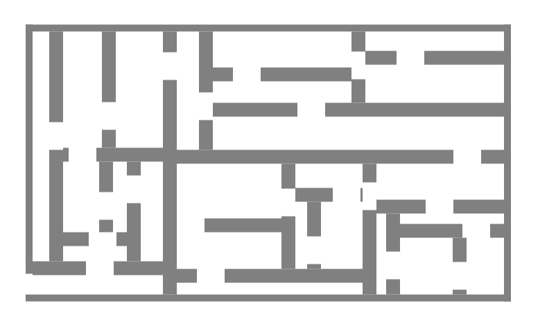
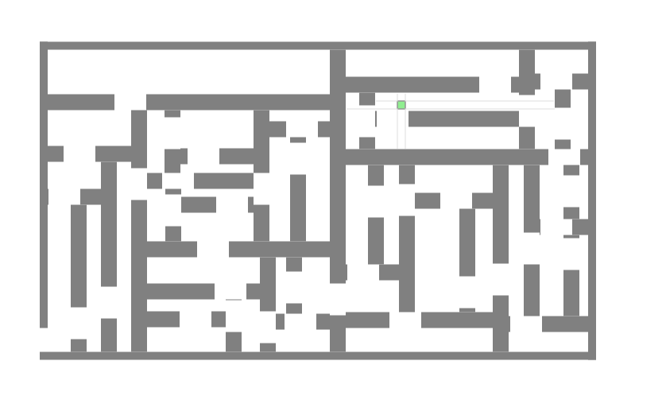
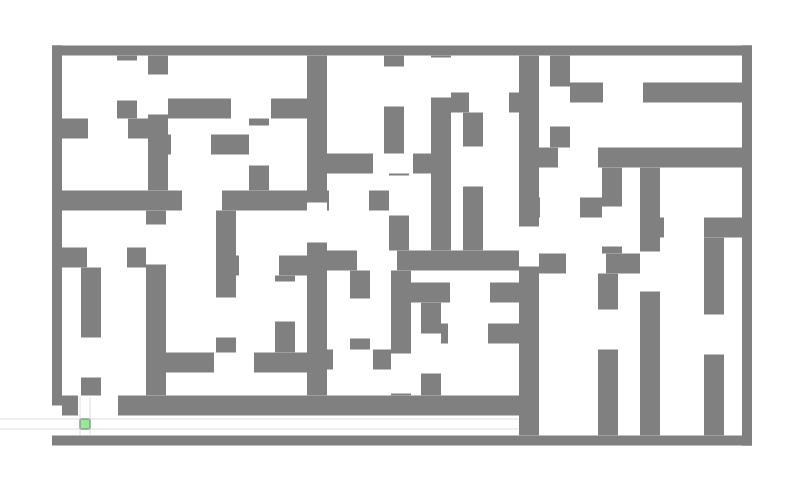
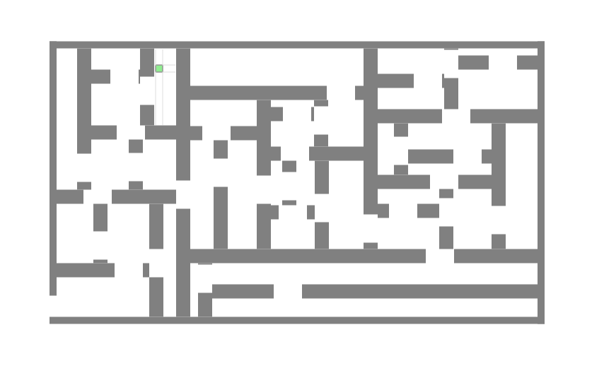
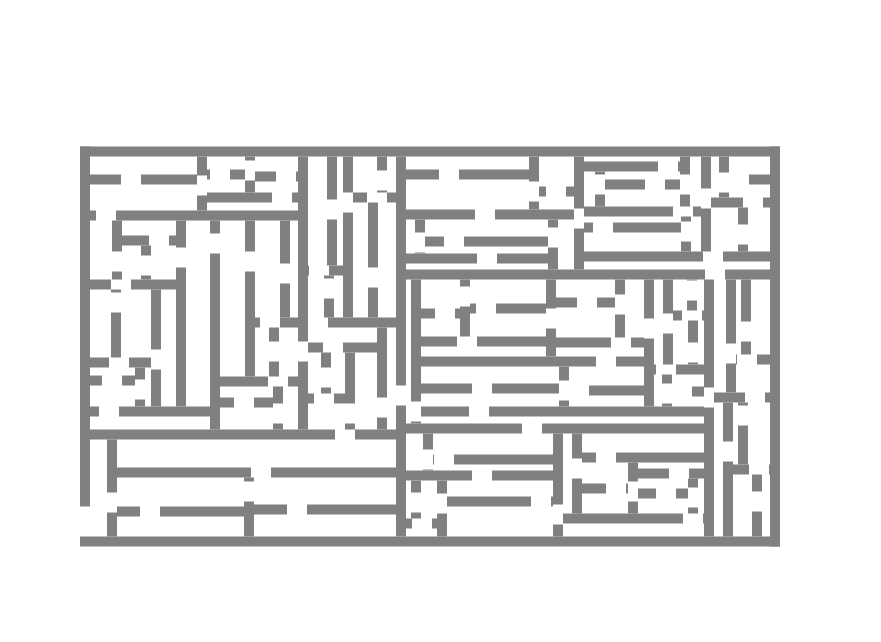

# Maze Generation & Solving (C++)
- Event management and process scheduling using Elma and Enviro 
- A randomized maze generator using a divide & conquer algorithmic paradigm (recursive division).
- A dynamic agent (robot) that uses effective backtracking + depth-first-search (DFS) to solve the maze. 

## Key challenges & highlights:
1. (Algorithm & design) DFS + Backtracking using map and stack:
   1. Visualizing the grid co-ordinates as graph nodes and use graph based search techniques like Depth-First Search (DFS) and Backtracking, without actually constructing the graph or edges explicitly. Assuming the the robot is performing a DFS traversal through the maze. 
   2. Designing a DFS algorithm without using recursion: Given how event management and process scheduling works in elma and enviro it is difficult to code a recursive DFS inside during() or any class method. Solved this efficiently by using the first-in-last-out data-structure (STL `stack`). The stack tracked the order in which nodes (i.e the robot position co-ordinates) get accessed and traversed in the maze. 
   3. Keeping tracking of the cells visited by the robot in the maze using a STL `map<>` container. 
   4. Effectively backtracking through dead ends (i.e leaf nodes) in linear time by using `stack` to track the order of entry of cells.  
2. (Algorithm & design) Randomized divided & conquer based maze generation:
   1. Recursively dividing the empty region into smaller sub-regions and processing each through a similar recursive subroutine. 
   2. Using randomly generated vertical and horizontal axes to divide the region. Interpreting the axes as static agents (or walls). 
   3. Creating a randomized gap in each of the walls (or axis) to connect the divided sub-regions, to form a maze. 
3. Implementation challenges: 
   1. Working with integer aproximations of the robot locations. Storing and handling the state space (in maps and stacks) would be too large to handle if we consider all the possible floating point values too. 
   2. Calculating closed polygon points inside the recursive division subroutine to represent static agent shapes in a format the enviro expects. 
   3. Integrating DFS+Backtracking and Divide & Conquer paradigms as processes in enviro. 
   4. Converting the generated maze to json and writing to the `config.json` file that enviro renders on screen. 

I did not get the time to catalogue all the bugs and issues I face during the implementation phase. 

## File structure & hierarchy:
Briefly highlighting some important files:
- I have define and implement various modules used for generating the randomized maze in the files `maze_gen.h` and  `maze_gen.cc`. The maze is converted to json and written into the `config.json` file in the `update_enviro_config()` method in the MAZE class.
- `run.sh` is used to start the project 
- `src/my_robot.h` used to implement the Robot controller (DFS + Backtracking). 


## Starting the project: 
First start docker v1.2: 
```
docker run -p80:80 -p8765:8765 -v $PWD:/source -it klavins/enviro:v1.2 bash
esm start
```
then run the shell script:
``` 
bash run.sh 
```

The bash script performs the following:
- Compiles and runs `maze_gen`. 
- Compiles the robot source codes through `make`
- Starts Enviro 

## Usage:
The usage is fairly simple:
1. After starting the project using the bash script, open `localhost`.
2. You'll find a freshly generated maze on screen without robot: 
3. The robot is assigned an initial position based on `screen click`. Therefore click on an emtpy space in the maze.
4. That's it! Watch the robot traverse the maze. If there is no path (with enough gap to go through) then the robot will backtrack to the initial starting point and stop. Or else it will escape the grid border and wait outside for a new screen click. 
5. A new maze is generated everytime the bash script is run. Here are some sample "in action" screenshots: 







Note that it is possible to change the wall width and recursion depth in my maze generator code (`maze_gen.cc`) to get arbitrarily complex mazes! 


However, it takes more computation and occupies more memory to store. Moreover, the robot size needs to be manually adjusted to fit in the small gaps in the maze, which is not very pleasing to the eye. I will upload more screenshots and videos (possibly) if time permits. 

## References:
All the code is original and written from scratch by me. I don't use any pre-built libraries or third-party code, other than json, enviro, and c++ stl. However, the general algorithmic principles used are variations of popular literature:- 
1. Recursive Division for Maze Generation [link](https://weblog.jamisbuck.org/2011/1/12/maze-generation-recursive-division-algorithm)
2. DFS and BFS using Stacks and Queues [PDF](http://web.cs.unlv.edu/larmore/Courses/CSC477/bfsDfs.pdf)

Also, I've used [KlavinsLab GitHub](https://github.com/klavinslab), [Stackoverflow](https://stackoverflow.com/), and CPP language docs for some general syntaxes related debugging. 
